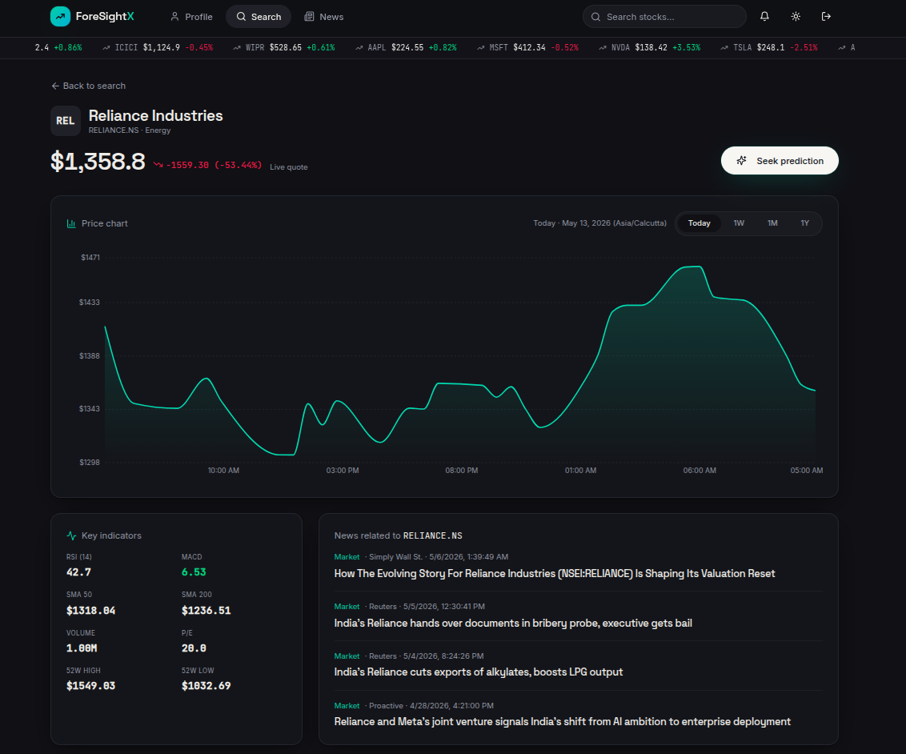
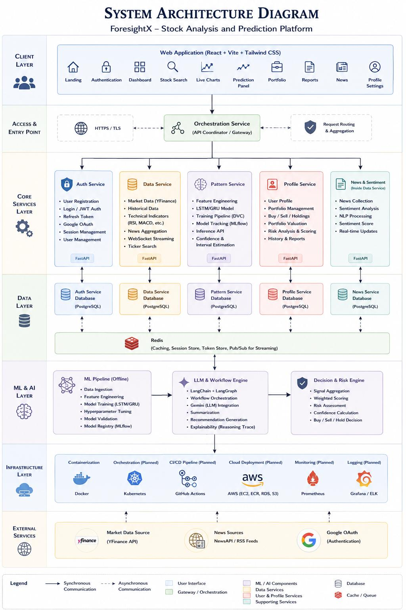

# ForesightX

**[Live Application](https://foresightx.apst.me) · [Full Documentation](https://apst.me/ForesightX/) · [Architecture](https://apst.me/ForesightX/docs/architecture) · [API Reference](https://apst.me/ForesightX/docs/api/endpoints)**

ForesightX is a microservice-based intelligent stock analytics and decision-support platform. It combines live market data, historical price analysis, technical indicators, machine-learning predictions, portfolio context, financial news, and AI-assisted recommendation generation in one user-facing workflow.

The project was built to solve a practical problem: stock research is usually fragmented across charting applications, news feeds, screeners, portfolio tools, and disconnected prediction experiments. A user may have access to plenty of data but still needs to manually connect the signals. ForesightX brings those concerns together while preserving clear technical boundaries between identity, market data, prediction, user context, and orchestration.

> ForesightX is a decision-support and engineering project. It does not execute brokerage transactions and its output should not be interpreted as guaranteed financial advice.



## What the Product Does

A registered user can search for an instrument, inspect current and historical price movement, view important market indicators, read related news, request short-horizon predictions, maintain portfolio information, and receive a recommendation assembled from multiple sources of evidence.

The platform does not treat a model prediction as a complete answer. The final analysis can include:

- current quote and historical OHLCV data;
- technical indicators and recent market movement;
- next-hour or next-day directional prediction signals;
- model confidence and inference metadata;
- relevant news and market context;
- the user's holdings, cash, exposure, and risk information;
- deterministic risk and recommendation rules; and
- an AI-assisted explanation generated through the orchestration workflow.

This makes the result easier to understand than an isolated numeric forecast. The recommendation is accompanied by context and can degrade to deterministic behavior when an optional AI dependency is unavailable.

## Engineering Highlights

ForesightX demonstrates full-stack engineering across distributed backend systems, machine learning, frontend development, deployment, and technical documentation.

- **Microservice ownership:** authentication, data, prediction, profile, and orchestration responsibilities are separated into independently testable services.
- **Contract-based integration:** services communicate through validated HTTP APIs instead of directly reading one another's databases.
- **Service-owned persistence:** stateful services own their schemas and migrations, reducing coupling as the system evolves.
- **Production-shaped routing:** the browser uses same-origin `/api/...` routes through NGINX rather than connecting to private containers directly.
- **Reproducible ML workflow:** DVC, MLflow, and DAGsHub concepts support dataset, experiment, and model-artifact traceability.
- **Resilient recommendation flow:** external responses are validated and orchestration includes explicit failure and fallback behavior.
- **Containerized execution:** Docker images, Docker Compose, private networking, health checks, and environment-based configuration provide repeatable deployment.
- **Responsive UX:** the React application and Docusaurus documentation share a consistent financial-product design across desktop and mobile layouts.

## Architecture



The frontend is a React and Vite single-page application. In the deployed topology, NGINX is the public entrypoint and routes browser requests to the appropriate backend container. Backend services remain private on the Docker network.

```text
Browser
  |
  v
NGINX reverse proxy
  |-- /                       -> React frontend
  |-- /api/auth/              -> Auth service
  |-- /api/profile/           -> Profile service
  |-- /api/data/              -> Data service
  |-- /api/pattern/           -> Pattern service
  `-- /api/orchestration/     -> Orchestration service
```

### Core Services

| Service | Responsibility |
| --- | --- |
| **Frontend** | Search, charts, analysis, news, authentication, portfolio, profile, and responsive UI states |
| **Auth** | Registration, login, password security, JWT access and refresh tokens, session revocation, and Google OAuth |
| **Data** | Instrument search, live quotes, historical bars, indicators, news, caching, persistence, and WebSocket updates |
| **Pattern** | Feature preparation, model loading, short-horizon inference, confidence output, and model metadata |
| **Profile** | User details, profile images, cash balance, portfolio positions, transactions, and risk context |
| **Orchestration** | Analysis jobs, multi-service coordination, LangGraph state, Gemini integration, safeguards, and final responses |

Redis supports caching and revocable session state. PostgreSQL or NeonDB provides persistent relational storage. The services expose health endpoints so operators can distinguish a running process from a functioning application.

## Analysis Workflow

When a user requests analysis, the orchestration service validates the request and creates an explicit workflow state. It retrieves market evidence from the Data service, prediction evidence from the Pattern service, and portfolio or risk context from the Profile service. These responses are normalized before recommendation logic is applied.

The workflow can then use Gemini to structure an explanation while retaining deterministic rules for validation, confidence handling, and risk constraints. Analysis jobs and events make the sequence traceable and easier to debug than a single endpoint containing all behavior.

The architecture is deliberately API-driven. The Pattern service does not query the Data database directly, and Orchestration does not query Profile tables. This preserves service ownership and allows an API implementation, provider, schema, or model to change without requiring every consumer to share internal database knowledge.

## Machine-Learning Pipeline

The prediction service is designed around a reproducible offline-to-online process:

1. collect and validate historical OHLCV data;
2. clean and normalize the time series;
3. compute technical features and rolling windows;
4. split data without future leakage;
5. train and evaluate candidate models;
6. record experiments and version artifacts;
7. promote a selected model into inference; and
8. apply the saved preprocessing contract to live requests.

The current project uses Python-based data and ML tooling including PyTorch, scikit-learn, NumPy, and Pandas. DVC and MLflow-compatible workflows make it possible to connect a prediction to the data, parameters, metrics, and artifact version that produced it.

Prediction output is intentionally presented as probabilistic evidence. Financial time series are noisy and change across market regimes, so confidence, validation, drift monitoring, and backtesting are more meaningful than claiming guaranteed accuracy.

## Technology Stack

| Layer | Technologies |
| --- | --- |
| Frontend | React, TypeScript, Vite, Tailwind CSS, component-driven UI |
| Documentation | Docusaurus, React, responsive custom theme |
| Backend | Python, FastAPI, Pydantic, SQLAlchemy |
| Data | PostgreSQL, NeonDB, Redis |
| Machine learning | PyTorch, scikit-learn, NumPy, Pandas |
| MLOps | MLflow, DVC, DAGsHub |
| Orchestration | LangGraph, Gemini, deterministic policy logic |
| Operations | Docker, Docker Compose, NGINX, GitHub Actions, AWS-oriented infrastructure |

## Testing and Reliability

The project includes unit, API, integration, and system-level validation. Backend services use `pytest`; frontend utilities and components use Vitest and Testing Library. Tests cover token behavior, configuration, market-data normalization, feature engineering, model input handling, portfolio logic, orchestration tools, API schemas, and health endpoints.

Integration checks focus on the boundaries most likely to fail in a distributed system: Auth-to-Profile creation, Data-to-Pattern feature contracts, Profile-to-Orchestration context, proxy routing, authorization headers, WebSocket upgrades, external provider failures, and partial dependency responses.

Operational reliability is supported through health checks, structured service boundaries, Redis caching, explicit configuration, private backend networking, and fallback recommendation logic. The documentation includes captured test reports, database verification screenshots, system diagrams, and the complete project methodology.

## Security Approach

Authentication uses hashed passwords, short-lived JWT access tokens, refresh-token controls, OAuth validation, and revocable session state. Deployment keeps backend services off public host ports and exposes one NGINX entrypoint. Secrets are supplied through environment files or managed secret stores rather than committed into source control.

The current baseline also emphasizes least-privilege database credentials, restricted SSH access, TLS before transmitting real credentials, regular dependency rebuilds, and non-root application containers. A production financial system would require deeper security review, audit logging, monitoring, rate-limit tuning, data-governance controls, and formal model-risk management.

## Repository and Documentation

This repository contains the Docusaurus documentation site used to explain the complete ForesightX platform. It includes:

- product and recruiter-oriented overview pages;
- responsive application screenshots;
- system, component, class, sequence, activity, collaboration, and state diagrams;
- individual microservice responsibilities and APIs;
- database ownership and design decisions;
- ML training and prediction workflow documentation;
- testing reports and captured evidence;
- Docker, CI/CD, AWS, and deployment guidance; and
- execution planning, outcomes, roadmap, and SWOT analysis.

The most useful starting points are the **[full documentation](https://apst.me/ForesightX/)**, **[system architecture](https://apst.me/ForesightX/docs/architecture)**, **[service catalog](https://apst.me/ForesightX/docs/microservices)**, and **[product experience](https://apst.me/ForesightX/docs/product-experience)**.

## Run the Documentation Locally

Node.js 20 or newer is recommended.

```bash
npm ci
npm run start
```

Create and verify the production build with:

```bash
npm run build
npm run serve
```

The generated static site is written to `build/` and can be deployed to Vercel, GitHub Pages, S3/CloudFront, or any static hosting platform.

## Deployment Status

- **Application:** [https://foresightx.apst.me](https://foresightx.apst.me)
- **Documentation:** [https://apst.me/ForesightX/](https://apst.me/ForesightX/)
- **Source:** [https://github.com/TheAditya-10/ForesightX](https://github.com/TheAditya-10/ForesightX)

The documentation site has a strict broken-link build, responsive desktop and mobile layouts, extracted project diagrams, explicit update metadata, and Vercel configuration. The wider application deployment uses containerized services behind NGINX, with an architecture that can later move toward managed container orchestration when traffic and operational requirements justify it.

## Project Scope and Next Steps

ForesightX is best described as a complete decision-support prototype with production-shaped engineering. The next priorities are observability, model drift measurement, scheduled evaluation, stronger CI/CD promotion gates, managed secrets, automated database migration checks, high-availability deployment, and expanded backtesting.

Future product work can add broader instrument coverage, richer portfolio-risk policies, more model families, scenario analysis, feature-level explanations, and personalized recommendation controls. These improvements should follow measurement and governance rather than simply increasing model or infrastructure complexity.

---

**Last documentation update: June 12, 2026.**
